# Аналитика. «Морской бой 100×100»

**Авторы:** Зюзьков, Коротков
**Версия документа:** 1.0
**Основа:** дизайн-документ v1.0, продукт v1.9
**Нотация:** UML, диаграммы в Mermaid. В Mermaid нет диаграммы вариантов использования, поэтому она нарисована блок-схемой: роли — прямоугольники, варианты использования — овалы, связи `include` и `extend` — пунктирные стрелки.

## 1. Что покрыто аналитикой

Детализированы все функциональные требования первой версии, FR-1…FR-30: обязательные (О) и желательные (Ж). Не детализированы FR-31…FR-36 (раздел 7.6 дизайн-документа, вне первой версии). FR-37 (телефон) только отмечен в таблице трассируемости как пробел.

| Блок | Требования | Варианты использования |
|---|---|---|
| Лобби и подключение | FR-1…FR-8 | UC-01…UC-08, UC-25 |
| Расстановка | FR-9…FR-13 | UC-09…UC-11 |
| Бой | FR-14…FR-20 | UC-12…UC-15 |
| Гаджеты | FR-21…FR-26 | UC-16…UC-20 |
| Интерфейс и устойчивость | FR-27…FR-30 | UC-21…UC-24 |

**Роли:**
- **Игрок:** любой из двух участников.
- **Создатель:** игрок №1, создавший лобби. Он является частным случаем игрока.
- **Хост:** человек, запустивший сервер на своём ПК.
- **Таймер переподключения:** системный актор. Он засчитывает поражение через 60 секунд после обрыва.

## 2. Описание функций

В каждой строке: актор, вход, выход или изменение состояния, бизнес-правила, связи (что было до функции и что бывает после).

### 2.1. Лобби и подключение

| Функция (FR / UC) | Актор | Вход | Выход / изменение состояния | Бизнес-правила | Связи |
|---|---|---|---|---|---|
| **Ввод имени** (FR-1 / UC-01) | Игрок | Строка из поля имени | Имя игрока в состоянии и журнале | Сервер удаляет управляющие символы и `<` `>`, сжимает пробелы, обрезает до 20 символов. Пустое имя заменяется на «Игрок». Клиент экранирует имя при выводе | До: открыто меню. После: UC-02 или UC-03 |
| **Создание лобби** (FR-2 / UC-02) | Создатель | Имя | Лобби в фазе LOBBY. Код из 6 символов. Секретный токен переподключения. Игрок №1 | Алфавит из 32 символов без 0/O и 1/I. Код уникален. Не больше 500 лобби. Нельзя создать лобби, находясь в другом | До: UC-01. После: UC-03 другого игрока, UC-04 |
| **Подключение по коду** (FR-3 / UC-03) | Игрок | Имя, код (регистр не важен) | Игрок №2 и его токен. Создатель получает уведомление `opponent_joined` | Лобби существует. Фаза LOBBY. В лобби меньше двух игроков. Соединение не состоит в другом лобби | До: UC-01, код от создателя. После: UC-04 |
| **Начало игры** (FR-4 / UC-04) | Создатель | Команда `start_game` | Фаза PLACEMENT. Каждому игроку выдан набор кораблей из `FLEET` | Только создатель. В лобби ровно два игрока. Кнопка в интерфейсе неактивна, пока нет второго игрока | До: UC-02, UC-03. После: UC-09 |
| **Выход из лобби или партии** (FR-5 / UC-05) | Игрок | Команда `leave` | Зависит от фазы (см. правила) | LOBBY, выходит гость: слот освобождается. LOBBY, выходит создатель: лобби закрыто, гость получает `lobby_closed`. PLACEMENT или BATTLE: выходящему засчитано поражение. FINISHED: простой выход. Лобби удаляется, когда не осталось соединений | До: любое состояние в лобби. После: меню |
| **Автопоиск хоста** (FR-6 / UC-06) | Игрок (гость) | Запуск с флагом `--join` | Браузер открывается на адресе хоста | Запрос по UDP 48000, ответ на UDP 48001. Ждём 4 с. Адрес принимается, только если открыт TCP-порт игры. Свои адреса игнорируются. Слышно по UDP, но TCP закрыт: сообщение о брандмауэре | До: хост запущен (UC-25). После: UC-03 |
| **Показ адреса сервера** (FR-7 / UC-07) | Хост | Открытие меню на самом хосте | Список URL локальной сети в меню | Частные адреса (192.168.x.x, 10.x.x.x) идут первыми. Адреса 169.254.x.x скрыты. У гостя подсказка не показывается | До: сервер запущен. После: хост сообщает адрес гостю |
| **Остановка сервера** (FR-8 / UC-08) | Хост | Кнопка «Выключить сервер» | Процесс сервера завершается | Запрос принимается только с 127.0.0.1 и ::1, иначе 403. Кнопка скрыта у гостя | До: UC-25. После: конец работы |

### 2.2. Фаза 1. Расстановка

| Функция | Актор | Вход | Выход | Бизнес-правила | Связи |
|---|---|---|---|---|---|
| **Расстановка корабля** (FR-9, FR-10, FR-13 / UC-09) | Игрок | Тип корабля «толщина×длина», левый верхний угол (x, y), ориентация h или v | Корабль на поле, виден только владельцу. Остаток набора уменьшен на 1 | Фаза PLACEMENT, игрок ещё не «Готов». В остатке есть корабль такого типа. Прямоугольник целиком в поле. Все клетки функциональны (не обстреляны, не мёртвые). Поверх своего корабля ставить нельзя. Для `h` длина идёт по ширине, для `v` по высоте. Клиент (FR-13) подсвечивает предпросмотр, на сервер он не влияет | До: UC-04. После: UC-10 (если есть совпадение) или UC-11 |
| **Взаимное уничтожение** (FR-11 / UC-10) | Система | Установка корабля на клетку с живым чужим кораблём | Новый и все затронутые чужие корабли получают статус `collided`, их клетки становятся «мёртвыми» | Уничтожаются корабли целиком. Установка считается выполненной: корабль списывается из набора или инвентаря. Действует и при установке купленного корабля в бою | До: UC-09 или UC-19. После: проверка победы (UC-14) |
| **Готовность** (FR-12 / UC-11) | Игрок | Команда `ready` | Флаг готовности. Когда готовы оба: фаза BATTLE, случайный первый ход, первому игроку +10 очков | После «Готов» расставлять корабли нельзя. Сервер **не проверяет**, что расставлены все корабли (вопрос OQ-1) | До: UC-09. После: UC-12 |

### 2.3. Фаза 2. Бой

| Функция | Актор | Вход | Выход | Бизнес-правила | Связи |
|---|---|---|---|---|---|
| **Выстрел** (FR-14, FR-15, FR-16, FR-17 / UC-12) | Игрок | Клетка (x, y) | Событие `shot_result`, новое состояние. Метка hit или miss. Очки | Фаза BATTLE, ход этого игрока. Клетка функциональна. Свой корабль обстреливать нельзя. Попадание: +1 очко, ход сохраняется. Если корабль поражён целиком: ещё +5, все его клетки мёртвые. Промах: ход переходит сопернику (UC-13) | До: UC-11. После: UC-13, UC-14 |
| **Доход за ход** (FR-18 / UC-13) | Система | Передача хода, а для первого игрока старт боя | +10 очков игроку, получившему ход | Начисляется только при получении хода. Серия попаданий новых очков не даёт. Старт: 50 очков | До: промах или старт боя |
| **Определение победителя** (FR-19 / UC-14) | Система | Любое событие, меняющее корабли, и тайм-аут | Фаза FINISHED, `game_over` | Нет живых кораблей у одного: победа другого (`all_ships_sunk`). Нет у обоих: ничья (`mutual_destruction`). Также поражение за выход (`left`) или за обрыв (`disconnect`). После конца раскрываются уцелевшие корабли соперника | После: UC-23 |
| **Журнал событий** (FR-20 / UC-15) | Игрок | — | Последние 40 записей | Свои действия описаны подробно. У соперника текст обезличен (например, «совершена покупка»). Скрытые координаты в журнал не попадают | — |

### 2.4. Гаджеты

| Функция | Актор | Вход | Выход | Бизнес-правила | Связи |
|---|---|---|---|---|---|
| **Покупка гаджета** (FR-21 / UC-16) | Игрок | Вид (`scan`, `area_shot`, `ship`), форма (w, h) | Предмет в инвентаре, очки списаны | Только в BATTLE и в свой ход. Форма из списка в `constants.py`. Цену считает сервер: `ceil(max(0, w·h − free_cells) · per_cell)`, минимум 1. Для кораблей цена из таблицы. Очков должно хватать. Покупка ход не заканчивает | До: UC-11. После: UC-17, UC-18 или UC-19 |
| **Разведка области** (FR-22, FR-25 / UC-17) | Игрок | Предмет `scan`, левый верхний угол (x, y), признак поворота | Область запоминается навсегда. Предмет израсходован | В свой ход. Область целиком внутри поля. На клиенте клик ставит центр области, у края она сдвигается внутрь. R меняет ширину и высоту местами. Разведчик видит число найденных клеток | До: UC-16. После: изменение тумана у обоих |
| **Выстрел по области** (FR-23 / UC-18) | Игрок | Предмет `area_shot`, (x, y), поворот | Результат по каждой клетке, один `shot_result` | Недоступные клетки (обстрелянные, мёртвые, со своим кораблём) пропускаются. Если стрелять некуда, ошибка и предмет остаётся. Любое попадание сохраняет ход, иначе ход переходит | До: UC-16. После: UC-13, UC-14 |
| **Покупка корабля** (FR-24 / UC-19) | Игрок | Предмет-корабль, (x, y), ориентация | Новый корабль на поле | Правила UC-09 плюс ход игрока. Совпадение с чужим живым кораблём уничтожает оба (UC-10). Ход не передаётся | До: UC-16. После: UC-10, UC-14 |
| **Туман войны** (FR-25 / UC-17) | Система | Список разведанных областей, живые корабли | Для каждого игрока: свои области, области соперника, видимые вражеские корабли | Неразведанное затемнено. Разведанную любым игроком область видят оба. Живые корабли внутри такой области видны обоим (константа `SCAN_EXPOSES_OWN`). Видимость пересчитывается при каждой отправке состояния, поэтому корабль, поставленный позже, виден сразу | — |
| **Настройка баланса** (FR-26 / UC-20) | Хост | Правка `game/constants.py` | Новый баланс после перезапуска | Логику менять не нужно. Параметры: флот, очки, награды, формы и цены гаджетов | — |

### 2.5. Интерфейс и устойчивость

| Функция | Актор | Вход | Выход | Бизнес-правила | Связи |
|---|---|---|---|---|---|
| **Масштаб и сдвиг** (FR-27 / UC-21) | Игрок | Колесо, кнопки +/−/⤢, перетаскивание | Изменение вида | Только на клиенте. Масштаб ограничен (3…40 px на клетку). Отличие клика от перетаскивания: порог 5 px | — |
| **Переподключение** (FR-28 / UC-22) | Игрок, таймер | Обрыв соединения, затем `reconnect(code, token)` | Партия продолжается или засчитано поражение | Действует в PLACEMENT и BATTLE. Срок 60 с. Токен проверяется без утечки по времени. Старое соединение вытесняется. Сопернику виден отсчёт. В LOBBY обрыв равен выходу | До: игра идёт. После: UC-14 при тайм-ауте |
| **Экран результата** (FR-29 / UC-23) | Игрок | Фаза FINISHED, кнопка «Вернуться в меню» | Итог (победа, поражение, ничья, причина, очки). Возврат в меню | Кнопка шлёт `leave` и стирает токен. Новая партия: новое лобби | До: UC-14. После: UC-02 или UC-03 |
| **Открытие портов** (FR-30 / UC-24) | Хост, игрок | Запуск `main.py` | Правила для TCP 8000 и UDP 48000/48001 | Windows: `netsh`, один запрос UAC. Linux: ufw или firewalld только если включены, права через pkexec или sudo. Правила уже есть: ничего не делаем. Флаги `--no-firewall`, `--open-ports`. Ошибки только в лог | До: запуск. После: UC-06, UC-25 |

## 3. Диаграммы

### 3.1. Диаграмма вариантов использования

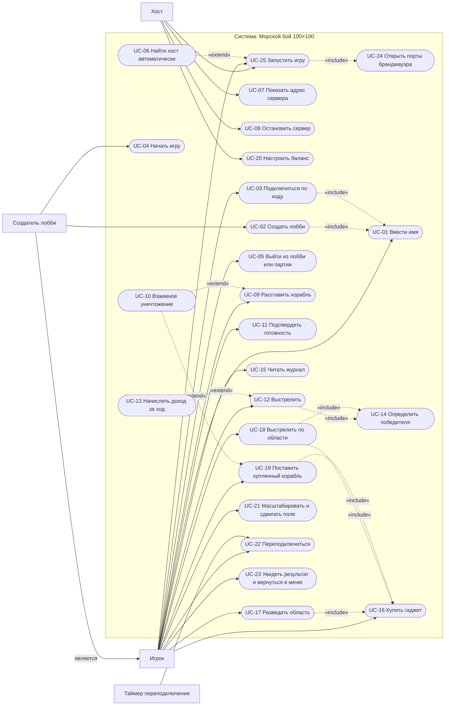
```mermaid
flowchart LR
  Host["Хост"]
  Creator["Создатель лобби"]
  Player["Игрок"]
  Timer["Таймер переподключения"]
  Creator -->|"является"| Player

  subgraph SYS["Система: Морской бой 100×100"]
    UC25(["UC-25 Запустить игру"])
    UC24(["UC-24 Открыть порты брандмауэра"])
    UC06(["UC-06 Найти хост автоматически"])
    UC07(["UC-07 Показать адрес сервера"])
    UC08(["UC-08 Остановить сервер"])
    UC20(["UC-20 Настроить баланс"])
    UC01(["UC-01 Ввести имя"])
    UC02(["UC-02 Создать лобби"])
    UC03(["UC-03 Подключиться по коду"])
    UC04(["UC-04 Начать игру"])
    UC05(["UC-05 Выйти из лобби или партии"])
    UC09(["UC-09 Расставить корабль"])
    UC10(["UC-10 Взаимное уничтожение"])
    UC11(["UC-11 Подтвердить готовность"])
    UC12(["UC-12 Выстрелить"])
    UC13(["UC-13 Начислить доход за ход"])
    UC14(["UC-14 Определить победителя"])
    UC15(["UC-15 Читать журнал"])
    UC16(["UC-16 Купить гаджет"])
    UC17(["UC-17 Разведать область"])
    UC18(["UC-18 Выстрелить по области"])
    UC19(["UC-19 Поставить купленный корабль"])
    UC21(["UC-21 Масштабировать и сдвигать поле"])
    UC22(["UC-22 Переподключиться"])
    UC23(["UC-23 Увидеть результат и вернуться в меню"])
  end

  Host --> UC25
  Host --> UC07
  Host --> UC08
  Host --> UC20
  Player --> UC25
  Player --> UC01
  Player --> UC03
  Player --> UC05
  Player --> UC09
  Player --> UC11
  Player --> UC12
  Player --> UC15
  Player --> UC16
  Player --> UC17
  Player --> UC18
  Player --> UC19
  Player --> UC21
  Player --> UC22
  Player --> UC23
  Creator --> UC02
  Creator --> UC04
  Timer --> UC22

  UC25 -.->|"«include»"| UC24
  UC06 -.->|"«extend»"| UC25
  UC02 -.->|"«include»"| UC01
  UC03 -.->|"«include»"| UC01
  UC10 -.->|"«extend»"| UC09
  UC10 -.->|"«extend»"| UC19
  UC13 -.->|"«extend»"| UC12
  UC12 -.->|"«include»"| UC14
  UC18 -.->|"«include»"| UC14
  UC17 -.->|"«include»"| UC16
  UC18 -.->|"«include»"| UC16
  UC19 -.->|"«include»"| UC16
```

**Пояснение.**
- UC-10 и UC-13 выполняются только при условии (совпадение кораблей, промах), поэтому это `extend`.
- UC-14 вызывается после каждого выстрела, поэтому это `include`.
- Любое применение гаджета требует предварительной покупки (UC-16).
- UC-22 запускают оба актора. Игрок возвращается сам, таймер отвечает за тайм-аут.

### 3.2. Диаграммы последовательности

**D-1. Создание лобби, подключение, начало игры (SC-01, SC-02, SC-04)**

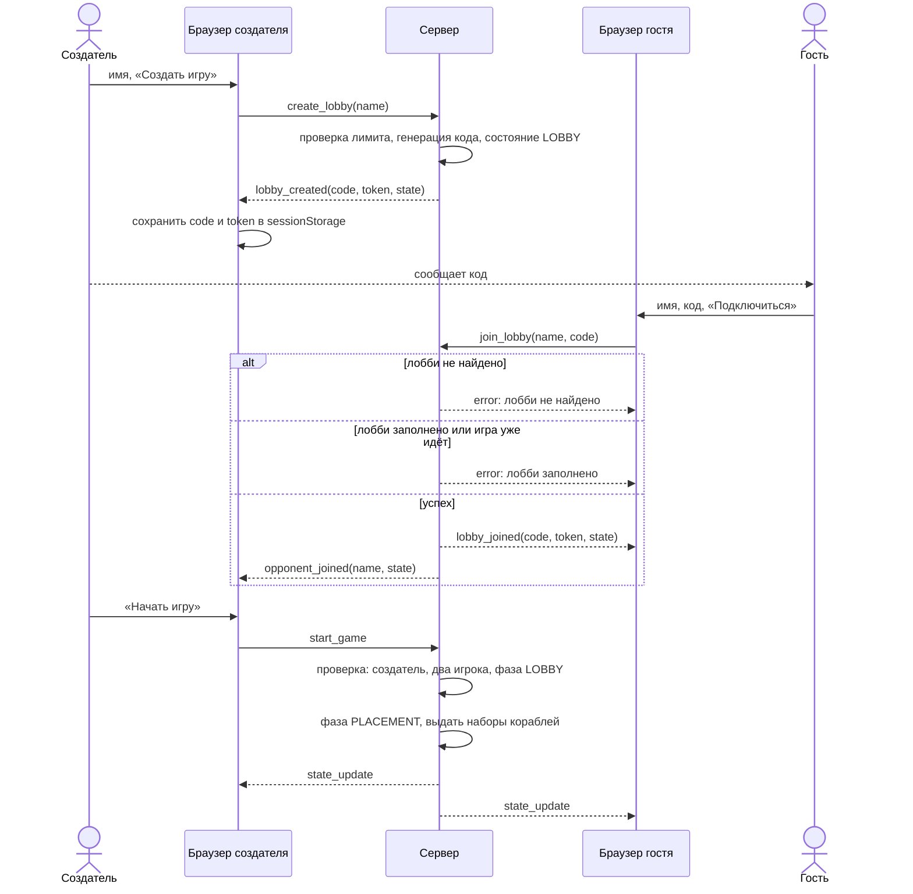
```mermaid
sequenceDiagram
  actor C as Создатель
  participant CB as Браузер создателя
  participant S as Сервер
  participant GB as Браузер гостя
  actor G as Гость

  C->>CB: имя, «Создать игру»
  CB->>S: create_lobby(name)
  S->>S: проверка лимита, генерация кода, состояние LOBBY
  S-->>CB: lobby_created(code, token, state)
  CB->>CB: сохранить code и token в sessionStorage
  C-->>G: сообщает код
  G->>GB: имя, код, «Подключиться»
  GB->>S: join_lobby(name, code)
  alt лобби не найдено
    S-->>GB: error: лобби не найдено
  else лобби заполнено или игра уже идёт
    S-->>GB: error: лобби заполнено
  else успех
    S-->>GB: lobby_joined(code, token, state)
    S-->>CB: opponent_joined(name, state)
  end
  C->>CB: «Начать игру»
  CB->>S: start_game
  S->>S: проверка: создатель, два игрока, фаза LOBBY
  S->>S: фаза PLACEMENT, выдать наборы кораблей
  S-->>CB: state_update
  S-->>GB: state_update
```

**D-2. Выстрел (SC-08)**

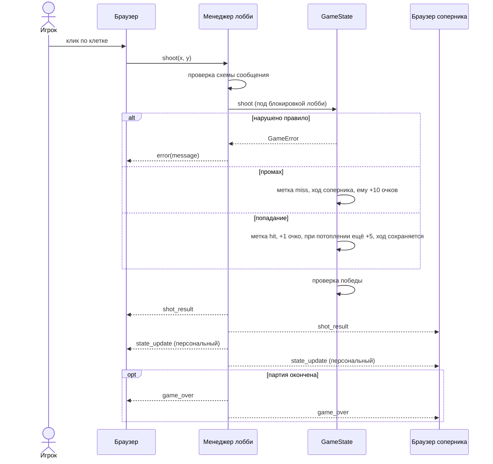
```mermaid
sequenceDiagram
  actor P as Игрок
  participant B as Браузер
  participant S as Менеджер лобби
  participant G as GameState
  participant O as Браузер соперника

  P->>B: клик по клетке
  B->>S: shoot(x, y)
  S->>S: проверка схемы сообщения
  S->>G: shoot (под блокировкой лобби)
  alt нарушено правило
    G-->>S: GameError
    S-->>B: error(message)
  else промах
    G->>G: метка miss, ход соперника, ему +10 очков
  else попадание
    G->>G: метка hit, +1 очко, при потоплении ещё +5, ход сохраняется
  end
  G->>G: проверка победы
  S-->>B: shot_result
  S-->>O: shot_result
  S-->>B: state_update (персональный)
  S-->>O: state_update (персональный)
  opt партия окончена
    S-->>B: game_over
    S-->>O: game_over
  end
```

**D-3. Покупка и применение разведки (SC-09, SC-10)**

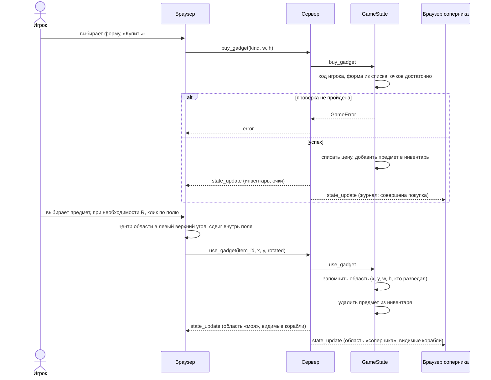
```mermaid
sequenceDiagram
  actor P as Игрок
  participant B as Браузер
  participant S as Сервер
  participant G as GameState
  participant O as Браузер соперника

  P->>B: выбирает форму, «Купить»
  B->>S: buy_gadget(kind, w, h)
  S->>G: buy_gadget
  G->>G: ход игрока, форма из списка, очков достаточно
  alt проверка не пройдена
    G-->>S: GameError
    S-->>B: error
  else успех
    G->>G: списать цену, добавить предмет в инвентарь
    S-->>B: state_update (инвентарь, очки)
    S-->>O: state_update (журнал: совершена покупка)
  end
  P->>B: выбирает предмет, при необходимости R, клик по полю
  B->>B: центр области в левый верхний угол, сдвиг внутрь поля
  B->>S: use_gadget(item_id, x, y, rotated)
  S->>G: use_gadget
  G->>G: запомнить область (x, y, w, h, кто разведал)
  G->>G: удалить предмет из инвентаря
  S-->>B: state_update (область «моя», видимые корабли)
  S-->>O: state_update (область «соперника», видимые корабли)
```

**D-4. Обрыв и переподключение (SC-13)**

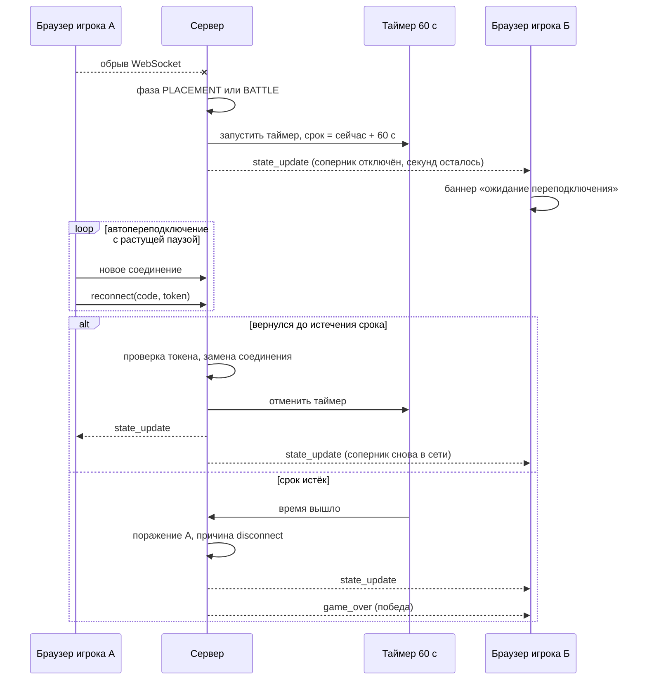
```mermaid
sequenceDiagram
  participant A as Браузер игрока А
  participant S as Сервер
  participant T as Таймер 60 с
  participant B as Браузер игрока Б

  A--xS: обрыв WebSocket
  S->>S: фаза PLACEMENT или BATTLE
  S->>T: запустить таймер, срок = сейчас + 60 с
  S-->>B: state_update (соперник отключён, секунд осталось)
  B->>B: баннер «ожидание переподключения»
  loop автопереподключение с растущей паузой
    A->>S: новое соединение
    A->>S: reconnect(code, token)
  end
  alt вернулся до истечения срока
    S->>S: проверка токена, замена соединения
    S->>T: отменить таймер
    S-->>A: state_update
    S-->>B: state_update (соперник снова в сети)
  else срок истёк
    T->>S: время вышло
    S->>S: поражение А, причина disconnect
    S-->>B: state_update
    S-->>B: game_over (победа)
  end
```

**D-5. Автопоиск хоста (SC-03)**

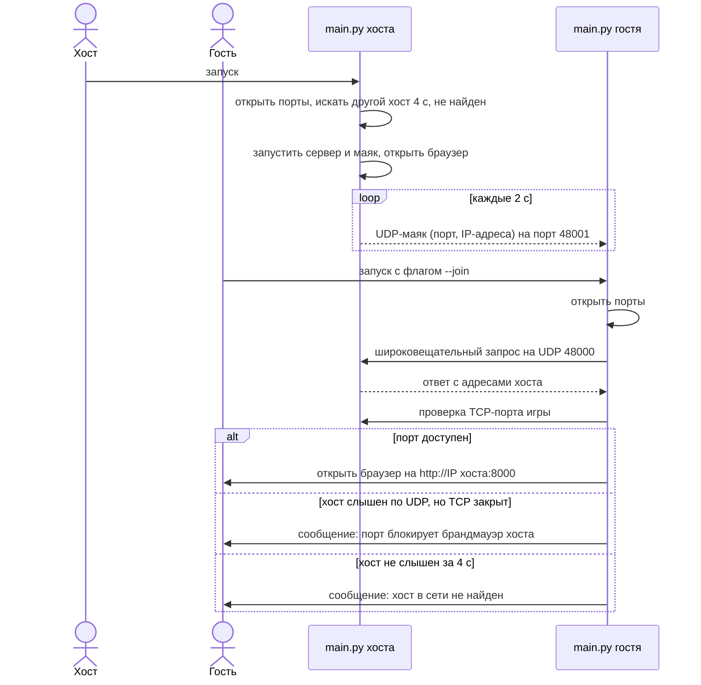
```mermaid
sequenceDiagram
  actor H as Хост
  actor G as Гость
  participant HM as main.py хоста
  participant GM as main.py гостя

  H->>HM: запуск
  HM->>HM: открыть порты, искать другой хост 4 с, не найден
  HM->>HM: запустить сервер и маяк, открыть браузер
  loop каждые 2 с
    HM-->>GM: UDP-маяк (порт, IP-адреса) на порт 48001
  end
  G->>GM: запуск с флагом --join
  GM->>GM: открыть порты
  GM->>HM: широковещательный запрос на UDP 48000
  HM-->>GM: ответ с адресами хоста
  GM->>HM: проверка TCP-порта игры
  alt порт доступен
    GM->>G: открыть браузер на http://IP хоста:8000
  else хост слышен по UDP, но TCP закрыт
    GM->>G: сообщение: порт блокирует брандмауэр хоста
  else хост не слышен за 4 с
    GM->>G: сообщение: хост в сети не найден
  end
```

### 3.3. Диаграммы деятельности

**A-1. Установка корабля (расстановка и покупка)**

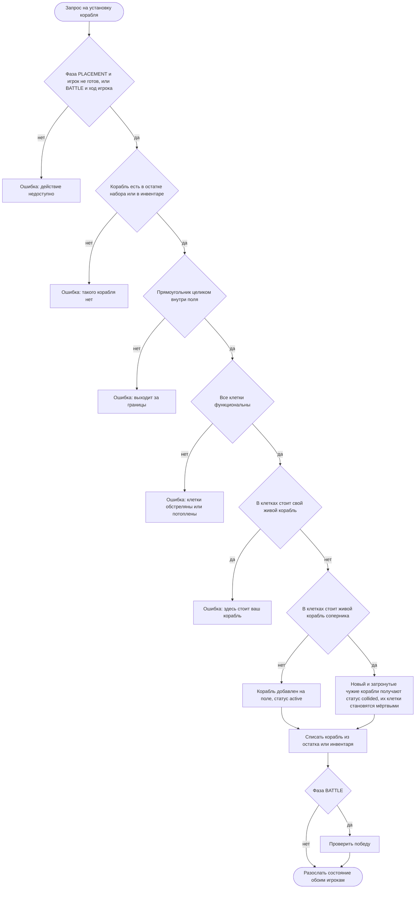
```mermaid
flowchart TD
  A(["Запрос на установку корабля"]) --> B{"Фаза PLACEMENT и игрок не готов, или BATTLE и ход игрока"}
  B -->|нет| E1["Ошибка: действие недоступно"]
  B -->|да| C{"Корабль есть в остатке набора или в инвентаре"}
  C -->|нет| E2["Ошибка: такого корабля нет"]
  C -->|да| D{"Прямоугольник целиком внутри поля"}
  D -->|нет| E3["Ошибка: выходит за границы"]
  D -->|да| F{"Все клетки функциональны"}
  F -->|нет| E4["Ошибка: клетки обстреляны или потоплены"]
  F -->|да| G{"В клетках стоит свой живой корабль"}
  G -->|да| E5["Ошибка: здесь стоит ваш корабль"]
  G -->|нет| H{"В клетках стоит живой корабль соперника"}
  H -->|нет| I["Корабль добавлен на поле, статус active"]
  H -->|да| J["Новый и затронутые чужие корабли получают статус collided, их клетки становятся мёртвыми"]
  I --> L["Списать корабль из остатка или инвентаря"]
  J --> L
  L --> M{"Фаза BATTLE"}
  M -->|да| N["Проверить победу"]
  M -->|нет| O(["Разослать состояние обоим игрокам"])
  N --> O
```

**A-2. Выстрел и выстрел по области**

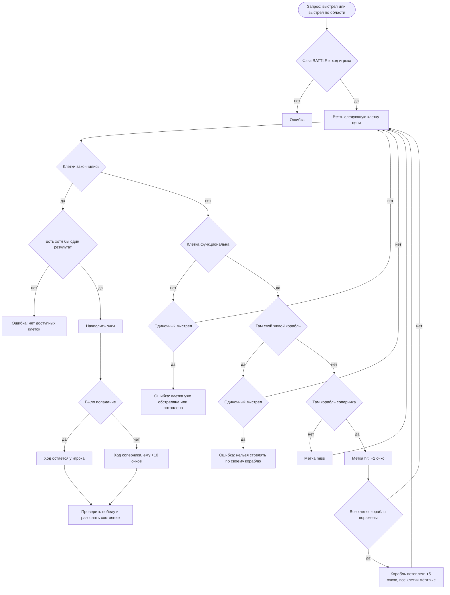
```mermaid
flowchart TD
  A(["Запрос: выстрел или выстрел по области"]) --> B{"Фаза BATTLE и ход игрока"}
  B -->|нет| X1["Ошибка"]
  B -->|да| C["Взять следующую клетку цели"]
  C --> D{"Клетки закончились"}
  D -->|да| R{"Есть хотя бы один результат"}
  D -->|нет| E{"Клетка функциональна"}
  E -->|нет| S1{"Одиночный выстрел"}
  S1 -->|да| X2["Ошибка: клетка уже обстреляна или потоплена"]
  S1 -->|нет| C
  E -->|да| F{"Там свой живой корабль"}
  F -->|да| S2{"Одиночный выстрел"}
  S2 -->|да| X3["Ошибка: нельзя стрелять по своему кораблю"]
  S2 -->|нет| C
  F -->|нет| G{"Там корабль соперника"}
  G -->|нет| H["Метка miss"]
  G -->|да| I["Метка hit, +1 очко"]
  I --> J{"Все клетки корабля поражены"}
  J -->|да| K["Корабль потоплен: +5 очков, все клетки мёртвые"]
  J -->|нет| C
  H --> C
  K --> C
  R -->|нет| X4["Ошибка: нет доступных клеток"]
  R -->|да| T["Начислить очки"]
  T --> U{"Было попадание"}
  U -->|да| V["Ход остаётся у игрока"]
  U -->|нет| W["Ход соперника, ему +10 очков"]
  V --> Y["Проверить победу и разослать состояние"]
  W --> Y
```

**A-3. Запуск программы (`main.py`)**

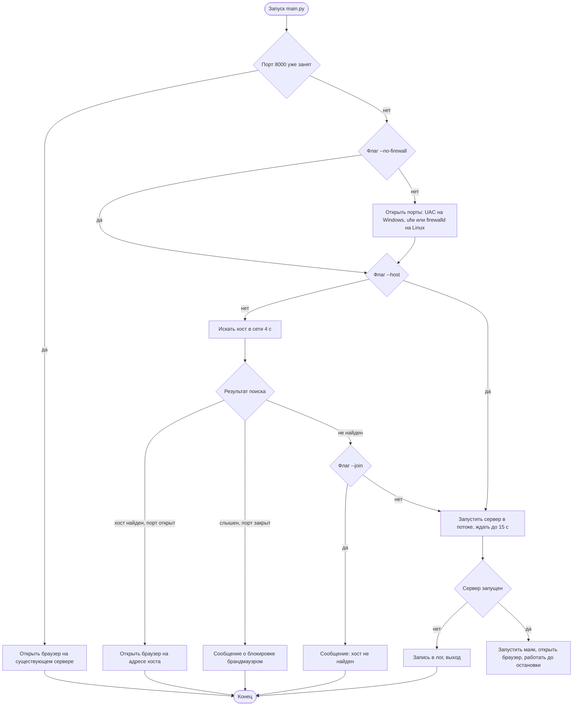
```mermaid
flowchart TD
  A(["Запуск main.py"]) --> B{"Порт 8000 уже занят"}
  B -->|да| C["Открыть браузер на существующем сервере"]
  C --> Z(["Конец"])
  B -->|нет| D{"Флаг --no-firewall"}
  D -->|нет| E["Открыть порты: UAC на Windows, ufw или firewalld на Linux"]
  D -->|да| F{"Флаг --host"}
  E --> F
  F -->|нет| G["Искать хост в сети 4 с"]
  G --> H{"Результат поиска"}
  H -->|хост найден, порт открыт| I["Открыть браузер на адресе хоста"]
  I --> Z
  H -->|слышен, порт закрыт| J["Сообщение о блокировке брандмауэром"]
  J --> Z
  H -->|не найден| K{"Флаг --join"}
  K -->|да| L["Сообщение: хост не найден"]
  L --> Z
  K -->|нет| M["Запустить сервер в потоке, ждать до 15 с"]
  F -->|да| M
  M --> N{"Сервер запущен"}
  N -->|нет| O["Запись в лог, выход"]
  O --> Z
  N -->|да| P["Запустить маяк, открыть браузер, работать до остановки"]
```

### 3.4. Диаграммы состояний

**S-1. Партия (фазы)**

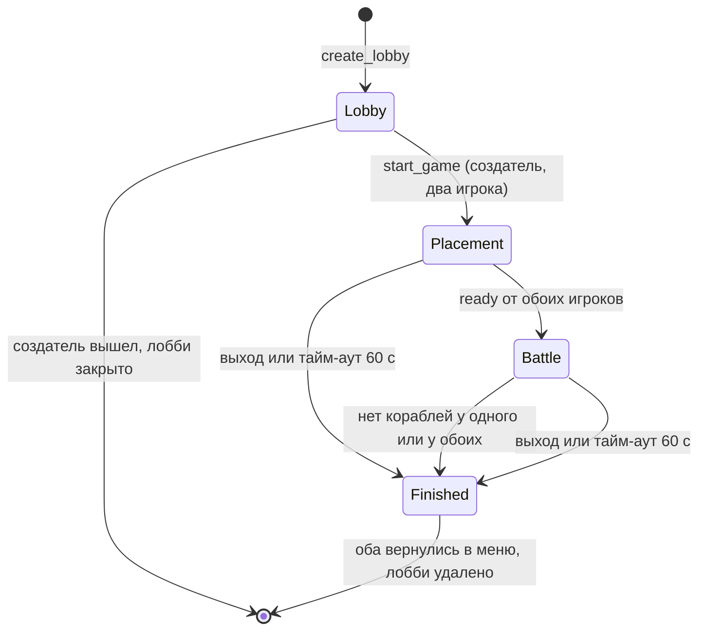
```mermaid
stateDiagram-v2
  [*] --> Lobby : create_lobby
  Lobby --> Placement : start_game (создатель, два игрока)
  Lobby --> [*] : создатель вышел, лобби закрыто
  Placement --> Battle : ready от обоих игроков
  Placement --> Finished : выход или тайм-аут 60 с
  Battle --> Finished : нет кораблей у одного или у обоих
  Battle --> Finished : выход или тайм-аут 60 с
  Finished --> [*] : оба вернулись в меню, лобби удалено
```
Если у игрока на старте боя нет ни одного живого корабля, партия заканчивается сразу после перехода в Battle.

**S-2. Очередность ходов внутри Battle**

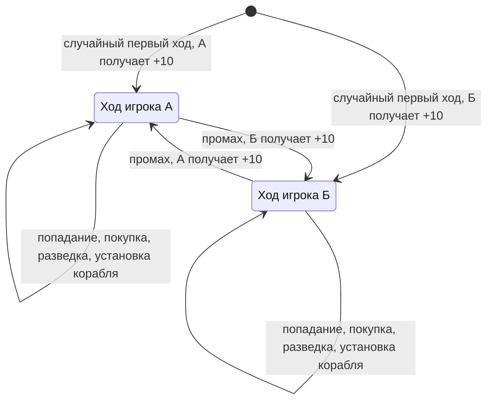
```mermaid
stateDiagram-v2
  state "Ход игрока А" as TA
  state "Ход игрока Б" as TB
  [*] --> TA : случайный первый ход, А получает +10
  [*] --> TB : случайный первый ход, Б получает +10
  TA --> TA : попадание, покупка, разведка, установка корабля
  TB --> TB : попадание, покупка, разведка, установка корабля
  TA --> TB : промах, Б получает +10
  TB --> TA : промах, А получает +10
```

**S-3. Корабль**

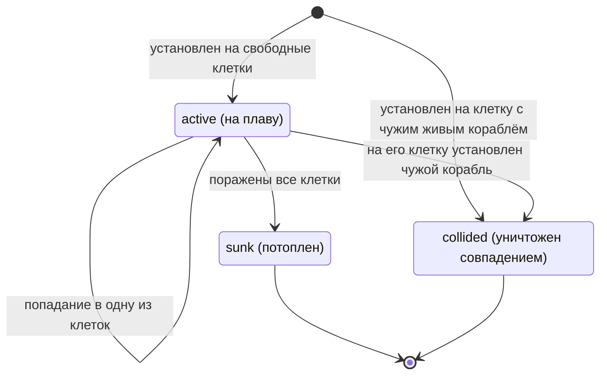
```mermaid
stateDiagram-v2
  state "active (на плаву)" as Active
  state "sunk (потоплен)" as Sunk
  state "collided (уничтожен совпадением)" as Collided
  [*] --> Active : установлен на свободные клетки
  [*] --> Collided : установлен на клетку с чужим живым кораблём
  Active --> Active : попадание в одну из клеток
  Active --> Sunk : поражены все клетки
  Active --> Collided : на его клетку установлен чужой корабль
  Sunk --> [*]
  Collided --> [*]
```

**S-4. Клетка поля (выстрелы)**

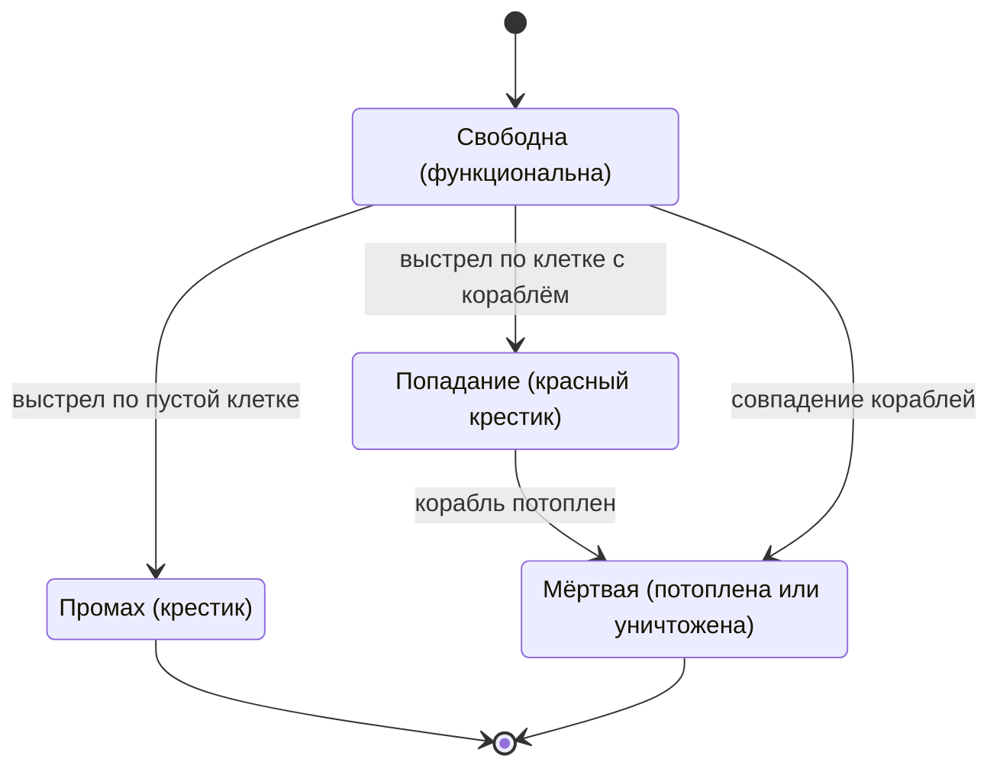
```mermaid
stateDiagram-v2
  state "Свободна (функциональна)" as Free
  state "Промах (крестик)" as Miss
  state "Попадание (красный крестик)" as Hit
  state "Мёртвая (потоплена или уничтожена)" as Dead
  [*] --> Free
  Free --> Miss : выстрел по пустой клетке
  Free --> Hit : выстрел по клетке с кораблём
  Hit --> Dead : корабль потоплен
  Free --> Dead : совпадение кораблей
  Miss --> [*]
  Dead --> [*]
```
Miss, Hit и Dead недоступны для выстрела и установки кораблей.

**S-5. Видимость клетки (туман войны)**

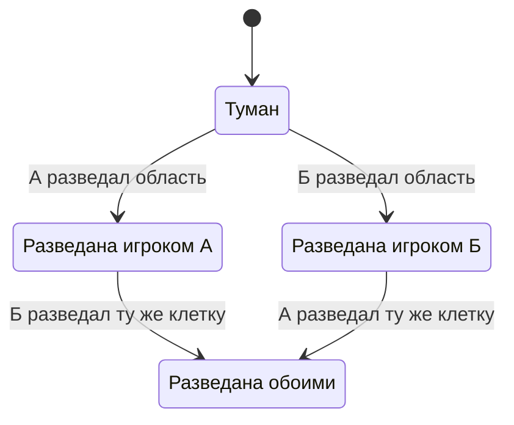
```mermaid
stateDiagram-v2
  state "Туман" as Fog
  state "Разведана игроком А" as RA
  state "Разведана игроком Б" as RB
  state "Разведана обоими" as RAB
  [*] --> Fog
  Fog --> RA : А разведал область
  Fog --> RB : Б разведал область
  RA --> RAB : Б разведал ту же клетку
  RB --> RAB : А разведал ту же клетку
```
Область разведана навсегда, возврата в туман нет. Разведанную любым игроком клетку видят оба.

**S-6. Соединение игрока**

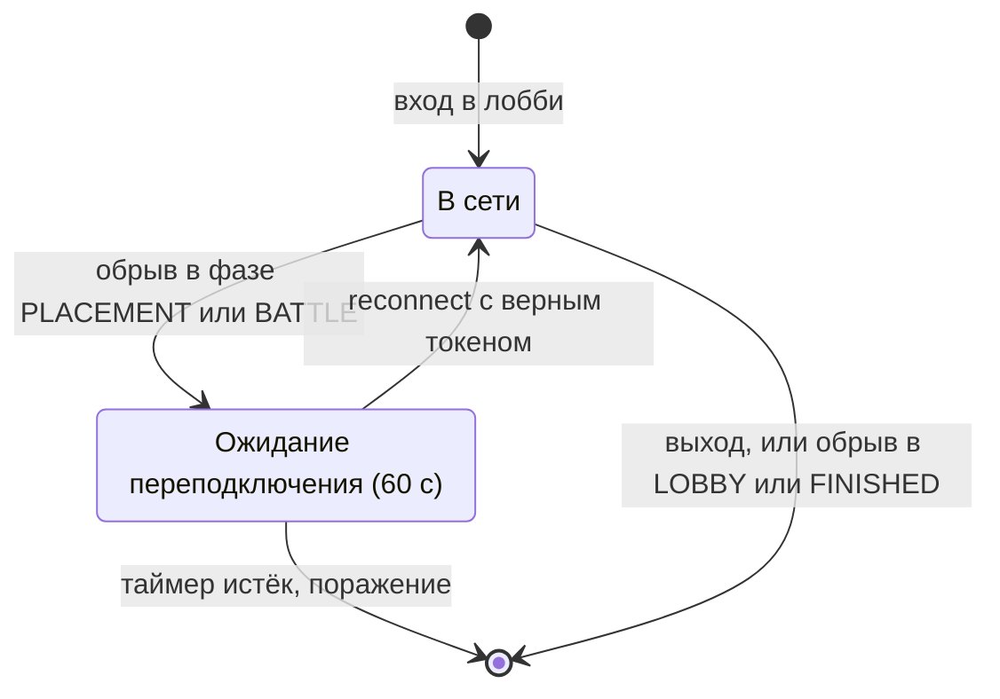
```mermaid
stateDiagram-v2
  state "В сети" as On
  state "Ожидание переподключения (60 с)" as Wait
  [*] --> On : вход в лобби
  On --> Wait : обрыв в фазе PLACEMENT или BATTLE
  Wait --> On : reconnect с верным токеном
  Wait --> [*] : таймер истёк, поражение
  On --> [*] : выход, или обрыв в LOBBY или FINISHED
```

**S-7. Предмет инвентаря**

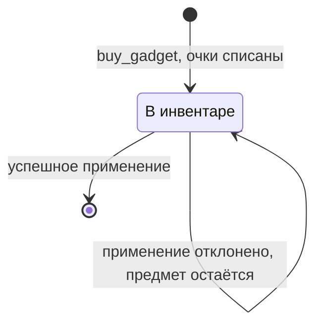
```mermaid
stateDiagram-v2
  state "В инвентаре" as Inv
  [*] --> Inv : buy_gadget, очки списаны
  Inv --> Inv : применение отклонено, предмет остаётся
  Inv --> [*] : успешное применение
```

## 4. Сценарии работы

### SC-01. Создание лобби (UC-01, UC-02; FR-1, FR-2)
- **Актор:** создатель.
- **Предусловия:** сервер работает, страница открыта, соединение не состоит в лобби.
- **Основной поток:**
  1. Игрок вводит имя и нажимает «Создать игру».
  2. Сервер очищает имя, создаёт лобби и генерирует код.
  3. Клиент получает код и токен, сохраняет их и показывает экран лобби.
  4. Создатель называет код второму игроку.
- **Альтернативные потоки:** имя пустое: подставляется «Игрок».
- **Исключения:** достигнут лимит лобби: «Сервер перегружен». Соединение уже в лобби: «Вы уже находитесь в лобби». Нет соединения: «Нет соединения с сервером».
- **Постусловия:** лобби в фазе LOBBY, создатель — игрок №1.

### SC-02. Подключение по коду (UC-03; FR-3)
- **Актор:** игрок (гость).
- **Предусловия:** есть код существующего лобби в фазе LOBBY.
- **Основной поток:**
  1. Гость вводит имя и код (6 символов) и нажимает «Подключиться к игре».
  2. Сервер находит лобби и добавляет игрока №2.
  3. Гость видит экран лобби. Создатель получает уведомление, и у него активируется «Начать игру».
- **Альтернативные потоки:** код введён строчными буквами: приводится к верхнему регистру.
- **Исключения:**
  - код не из 6 символов: сообщение клиента;
  - лобби не найдено;
  - лобби заполнено или игра уже идёт.
- **Постусловия:** в лобби два игрока, у каждого свой токен.

### SC-03. Автоматический поиск хоста (UC-25, UC-06, UC-24, UC-07; FR-6, FR-7, FR-30)
- **Актор:** гость, хост.
- **Предусловия:** оба ПК в одной сети. Хост запущен.
- **Основной поток:**
  1. Гость запускает игру с флагом `--join`.
  2. Программа открывает порты брандмауэра.
  3. Программа отправляет UDP-запрос, получает адреса хоста и проверяет TCP-порт.
  4. Браузер гостя открывается на адресе хоста.
- **Альтернативные потоки:**
  - запуск без флагов: программа ищет хост 4 с и, если не нашла, сама становится хостом;
  - флаг `--host`: поиск пропускается;
  - ручной вариант: гость вводит в браузере адрес из меню хоста (UC-07).
- **Исключения:**
  - хост слышен, TCP закрыт: сообщение о брандмауэре;
  - хост не найден при `--join`: сообщение;
  - права на открытие портов не получены: запись в лог, игра продолжается;
  - UDP-порт занят: поиск пропускается.
- **Постусловия:** гость открыл страницу игры на сервере хоста.

### SC-04. Начало игры (UC-04; FR-4)
- **Актор:** создатель.
- **Предусловия:** в лобби два игрока, фаза LOBBY.
- **Основной поток:**
  1. Создатель нажимает «Начать игру».
  2. Сервер переводит партию в PLACEMENT и выдаёт каждому набор кораблей.
  3. Оба видят поле и панель расстановки.
- **Исключения:** команду отправил не создатель: «Начать игру может только создатель». Нет второго игрока: «Нужен второй игрок».
- **Постусловия:** фаза PLACEMENT, никто не готов.

### SC-05. Расстановка корабля (UC-09; FR-9, FR-10, FR-13, FR-27)
- **Актор:** игрок.
- **Предусловия:** фаза PLACEMENT, игрок не нажал «Готов», в остатке есть корабли.
- **Основной поток:**
  1. Игрок выбирает тип корабля «толщина×длина».
  2. Наводит курсор: видит предпросмотр прямоугольника.
  3. Кликает по клетке: это левый верхний угол корабля.
  4. Сервер проверяет границы, функциональность клеток и свои корабли.
  5. Корабль появляется у владельца, счётчик остатка уменьшается.
- **Альтернативные потоки:**
  - R меняет ориентацию;
  - масштаб и сдвиг поля работают в любой момент;
  - выбранный тип закончился: выбирается следующий.
- **Исключения:**
  - выход за границы: ошибка, остаток не меняется;
  - поверх своего корабля: «Здесь уже стоит ваш корабль»;
  - клетка обстреляна или мёртвая: ошибка;
  - игрок уже «Готов»: «Вы уже нажали Готов».
- **Постусловия:** корабль виден только владельцу, остаток набора уменьшен.

### SC-06. Совпадение кораблей при расстановке (UC-10; FR-11)
- **Актор:** система, два игрока.
- **Предусловия:** у игрока Б стоит живой корабль. Игрок А ставит корабль, хотя бы одна клетка которого совпала с клеткой корабля Б.
- **Основной поток:**
  1. Игрок А ставит корабль.
  2. Сервер находит чужой живой корабль в клетках.
  3. Оба корабля целиком получают статус `collided`, их клетки становятся мёртвыми.
  4. В журнал попадает системное сообщение. Оба игрока получают новое состояние.
- **Альтернативные потоки:** совпали сразу с несколькими чужими кораблями: уничтожаются все.
- **Исключения:** при совпадении со своим кораблём действует правило SC-05.
- **Постусловия:** оба корабля не активны. Остаток набора игрока А уменьшился. Мёртвые клетки видны обоим игрокам (вопрос OQ-2).

### SC-07. Готовность (UC-11; FR-12)
- **Актор:** игрок.
- **Предусловия:** фаза PLACEMENT.
- **Основной поток:**
  1. Игрок нажимает «Готов».
  2. Сервер запоминает готовность. Игрок ждёт.
  3. Когда готов второй игрок, фаза меняется на BATTLE.
  4. Случайный игрок получает первый ход и +10 очков.
- **Альтернативные потоки:** соперник готов раньше: переход происходит сразу.
- **Исключения:** обрыв ожидающего игрока запускает SC-13. После конца фазы расстановки команда `ready` отклоняется.
- **Постусловия:** фаза BATTLE, у одного игрока ход. Если у кого-то нет живых кораблей, партия сразу заканчивается.

### SC-08. Выстрел (UC-12, UC-13, UC-14; FR-14…FR-20)
- **Актор:** игрок.
- **Предусловия:** фаза BATTLE, ход этого игрока.
- **Основной поток:**
  1. Игрок кликает по клетке.
  2. Сервер проверяет ход и клетку.
  3. Промах: метка miss, ход переходит, сопернику +10 очков.
  4. Попадание: метка hit, +1 очко, ход остаётся.
  5. Потопление: все клетки корабля мёртвые, ещё +5 очков.
  6. Клиенты получают `shot_result` и `state_update`. В журнале новая запись.
- **Альтернативные потоки:**
  - выстрел победный: сразу SC-14;
  - игрок может в любой момент покупать гаджеты (SC-09) и применять их, не тратя ход.
- **Исключения:**
  - не ваш ход;
  - клетка обстреляна или мёртвая;
  - по своему кораблю: «Нельзя стрелять по своему кораблю»;
  - вне поля или с лишними полями: сообщение отклоняется.
- **Постусловия:** обновлены метки, очки и ход. Партия может перейти в FINISHED.

### SC-09. Покупка гаджета (UC-16; FR-21)
- **Актор:** игрок.
- **Предусловия:** BATTLE, ход игрока.
- **Основной поток:**
  1. Игрок выбирает вид и форму, видит цену.
  2. Нажимает «Купить».
  3. Сервер считает цену и списывает очки.
  4. Предмет появляется в инвентаре и выбирается автоматически.
- **Альтернативные потоки:** игрок выбирает другой предмет или отменяет выбор.
- **Исключения:** не ваш ход. Очков не хватает: «Не хватает очков: нужно N, у вас M». Формы нет в списке. В интерфейсе кнопка неактивна, если очков не хватает.
- **Постусловия:** очки уменьшены, в инвентаре новый предмет, ход не изменился.

### SC-10. Разведка области (UC-17; FR-22, FR-25)
- **Актор:** игрок.
- **Предусловия:** в инвентаре есть разведка, ход игрока.
- **Основной поток:**
  1. Игрок выбирает предмет, при необходимости нажимает R.
  2. Кликает по полю: курсор становится центром области, у края область сдвигается внутрь.
  3. Клиент отправляет левый верхний угол и признак поворота.
  4. Сервер запоминает область и расходует предмет.
  5. У обоих игроков туман в области рассеивается. Живые корабли в области видны обоим.
- **Альтернативные потоки:** позже в области появляется новый корабль, и он становится виден без новой разведки.
- **Исключения:** область выходит за поле: ошибка, предмет остаётся. Не ваш ход. Предмета нет.
- **Постусловия:** область открыта навсегда. Ход у игрока сохраняется.

### SC-11. Выстрел по области (UC-18; FR-23)
- **Актор:** игрок.
- **Предусловия:** в инвентаре есть выстрел по области, ход игрока.
- **Основной поток:**
  1. Игрок выбирает предмет и кликает по полю.
  2. Сервер обходит клетки области, пропуская недоступные.
  3. Для каждой клетки определяется промах, попадание или потопление. Очки суммируются.
  4. Любое попадание сохраняет ход, иначе ход переходит.
- **Альтернативные потоки:** область содержит свои корабли: эти клетки пропускаются без ошибки.
- **Исключения:** нет ни одной доступной клетки: «В области нет клеток, доступных для выстрела», предмет остаётся.
- **Постусловия:** метки обновлены, очки начислены, возможна победа.

### SC-12. Покупка и установка корабля (UC-19, UC-10; FR-24)
- **Актор:** игрок.
- **Предусловия:** в инвентаре есть корабль, ход игрока.
- **Основной поток:**
  1. Игрок выбирает корабль, при необходимости нажимает R.
  2. Кликает по клетке: это левый верхний угол корабля.
  3. Сервер проверяет границы и функциональность клеток, затем ставит корабль.
  4. Корабль появляется у владельца, предмет расходуется.
- **Альтернативные потоки:** в клетках стоит живой корабль соперника: оба корабля целиком уничтожаются, партия может закончиться ничьёй или победой.
- **Исключения:** вне поля, на обстрелянной или мёртвой клетке, на своём корабле: ошибка, предмет остаётся.
- **Постусловия:** корабль на поле или оба корабля уничтожены. Ход не передаётся.

### SC-13. Обрыв соединения (UC-22; FR-28)
- **Актор:** игрок, таймер.
- **Предусловия:** фаза PLACEMENT или BATTLE.
- **Основной поток:**
  1. Соединение игрока А обрывается.
  2. Сервер запускает таймер на 60 с. Сопернику показан баннер с отсчётом.
  3. Страница А сама переподключается с растущей паузой и отправляет `reconnect`.
  4. Сервер проверяет токен и возвращает А в партию. Таймер отменяется.
- **Альтернативные потоки:** А обновил страницу: токен берётся из sessionStorage, и поток тот же.
- **Исключения:**
  - 60 с истекли: А проигрывает (`disconnect`), сопернику идёт `game_over`;
  - неверный токен или партии нет: клиент возвращается в меню;
  - обрыв в LOBBY считается выходом (SC-15);
  - оба игрока отключились: решает первый сработавший таймер (вопрос OQ-8).
- **Постусловия:** партия продолжается или завершена техническим поражением.

### SC-14. Завершение партии и возврат в меню (UC-14, UC-23, UC-05; FR-19, FR-29)
- **Актор:** игрок.
- **Предусловия:** у кого-то не осталось живых кораблей, либо поражение за выход или тайм-аут.
- **Основной поток:**
  1. Сервер переводит партию в FINISHED и рассылает `game_over`.
  2. Клиент показывает победу, поражение или ничью, причину и очки.
  3. Уцелевшие корабли соперника раскрыты на поле.
  4. Игрок нажимает «Вернуться в меню». Клиент шлёт `leave` и стирает токен.
  5. Когда вышли оба, лобби удаляется.
- **Альтернативные потоки:** игрок создаёт новое лобби. Реванша внутри лобби нет.
- **Исключения:** обрыв на экране результата не запускает тайм-аут.
- **Постусловия:** игрок в меню, старого лобби нет.

### SC-15. Выход из лобби или партии (UC-05; FR-5)
- **Актор:** игрок.
- **Предусловия:** игрок состоит в лобби.
- **Основной поток:**
  1. Игрок нажимает «Выйти» или «Вернуться в меню».
  2. Сервер обрабатывает выход по фазе (таблица FR-5 в разделе 2.1).
  3. Клиент возвращается в меню.
- **Альтернативные потоки:** создатель вышел из лобби: гость получает «Создатель закрыл лобби» и возвращается в меню.
- **Исключения:** выход в PLACEMENT или BATTLE: выходящему засчитано поражение (`left`). Подтверждения нет (вопрос OQ-9).
- **Постусловия:** игрок вне лобби, лобби обновлено или удалено.

### SC-16. Остановка сервера (UC-08; FR-8)
- **Актор:** хост.
- **Предусловия:** меню открыто на `127.0.0.1` или `localhost`.
- **Основной поток:**
  1. Хост нажимает «Выключить сервер».
  2. Браузер отправляет `POST /api/shutdown`.
  3. Сервер подтверждает запрос, процесс завершается.
  4. Страница показывает «Сервер остановлен».
- **Альтернативные потоки:** хост закрывает программу сам (Ctrl+C, диспетчер задач).
- **Исключения:** запрос со второго ПК: ответ 403.
- **Постусловия:** сервер остановлен, все лобби потеряны.

Отдельных сценариев нет у UC-13, UC-15, UC-20, UC-21. Доход и журнал входят в SC-08, масштаб поля в SC-05, баланс описан в таблице функций.

## 5. Таблица трассируемости

Столбцы «Компонент», «Тест» и «Раздел документации» заполняются на следующих этапах.

| Требование | Функция / UC | Диаграмма / сценарий | Компонент | Тест | Раздел документации |
|---|---|---|---|---|---|
| FR-1 Ввод имени | UC-01 | SC-01, SC-02; D-1 | | | |
| FR-2 Создание лобби | UC-02 | SC-01; D-1, S-1 | | | |
| FR-3 Подключение по коду | UC-03 | SC-02; D-1 | | | |
| FR-4 Начало игры | UC-04 | SC-04; D-1, S-1 | | | |
| FR-5 Выход из лобби или партии | UC-05 | SC-15, SC-14; S-1, S-6 | | | |
| FR-6 Автопоиск хоста | UC-06, UC-25 | SC-03; D-5, A-3 | | | |
| FR-7 Показ адреса сервера | UC-07 | SC-03 (альтернативный поток) | | | |
| FR-8 Остановка сервера | UC-08 | SC-16 | | | |
| FR-9 Расстановка кораблей | UC-09 | SC-05; A-1 | | | |
| FR-10 Запрет перекрытия своих | UC-09 | SC-05; A-1 | | | |
| FR-11 Взаимное уничтожение | UC-10 | SC-06, SC-12; A-1, S-3, S-4 | | | |
| FR-12 Готовность | UC-11 | SC-07; S-1 | | | |
| FR-13 Предпросмотр на поле | UC-09 | SC-05 (шаг 2). Отдельной диаграммы нет: функция клиентская | | | |
| FR-14 Выстрел | UC-12 | SC-08; D-2, A-2 | | | |
| FR-15 Правило хода | UC-12, UC-13 | SC-08; D-2, A-2, S-2 | | | |
| FR-16 Блокировка клеток | UC-12 | SC-08; A-2, S-4 | | | |
| FR-17 Очки за действия | UC-12 | SC-08, SC-11; A-2 | | | |
| FR-18 Стартовые очки и доход за ход | UC-13 | SC-07, SC-08; S-2 | | | |
| FR-19 Условие победы | UC-14 | SC-14; S-1, S-3 | | | |
| FR-20 Журнал событий | UC-15 | SC-08 (шаг 6). Отдельной диаграммы нет | | | |
| FR-21 Покупка гаджета | UC-16 | SC-09; D-3, S-7 | | | |
| FR-22 Разведка области | UC-17 | SC-10; D-3, S-5 | | | |
| FR-23 Выстрел по области | UC-18 | SC-11; A-2 | | | |
| FR-24 Покупка корабля | UC-19 | SC-12; A-1, S-7 | | | |
| FR-25 Туман войны | UC-17 | SC-10; S-5 | | | |
| FR-26 Настройка баланса | UC-20 | Таблица функций 2.4. Диаграммы и сценария нет | | | |
| FR-27 Масштаб и сдвиг поля | UC-21 | SC-05 (альтернативный поток). Диаграммы нет | | | |
| FR-28 Переподключение | UC-22 | SC-13; D-4, S-6 | | | |
| FR-29 Экран результата | UC-23 | SC-14; S-1 | | | |
| FR-30 Автооткрытие портов | UC-24, UC-25 | SC-03; D-5, A-3 | | | |
| FR-31…FR-36 (бот, чат, статистика, интернет, звуки, наблюдатель) | — | Вне первой версии, не детализированы | | | |
| FR-37 Адаптация для телефона | — | **Пробел:** диаграммы и сценария нет. Вёрстка адаптивная, на телефонах не тестировалась | | | |

**Анализ покрытия.** Все обязательные требования (О) покрыты сценарием и, где это уместно, диаграммой. Без диаграммы остались FR-13, FR-20, FR-26, FR-27: они клиентские или конфигурационные. У FR-37 нет ни сценария, ни диаграммы. Функциональность, не привязанная к требованиям дизайн-документа, есть: флаги `--host`, `--join`, `--no-firewall`, `--open-ports` и лимит 500 лобби. Их стоит добавить в дизайн-документ либо отнести к FR-6, FR-30.

## 6. Открытые вопросы и предположения

| № | Вопрос / неоднозначность | Принятое допущение | Что решить |
|---|---|---|---|
| OQ-1 | Сервер не проверяет, что игрок расставил весь набор. Нажать «Готов» можно с пустым полем | Допускаем: игрок сам отвечает за расстановку. Без кораблей он проигрывает сразу при старте боя | Требовать полный набор или хотя бы один корабль? |
| OQ-2 | FR-11 говорит об уничтожении «без раскрытия положения чужого корабля», а мёртвые клетки по правилам публичны и видны обоим | Принимаем: место столкновения публично, раскрывается только оно. Положение остальных кораблей скрыто | Скрывать ли место столкновения в фазе расстановки? |
| OQ-3 | Нет таймера хода и кнопки «закончить ход» | Ход переходит только после промаха. Бездействие игрока может задержать партию | Добавить таймер хода или пропуск? |
| OQ-4 | «Доход каждый ход» при серии попаданий | Очки начисляются только при получении хода | — |
| OQ-5 | Разведка раскрывает в области и свои, и чужие корабли (`SCAN_EXPOSES_OWN`). Трактовка согласована с ассистентом | Корабли обоих игроков видны обоим | Оставить или вернуть прежнее поведение (константа `False`) |
| OQ-6 | Баланс: купленный корабль 1×1 стоит 2 очка. Поставленный на клетку чужого корабля, он уничтожает целиком и его, и вражеский корабль. Для крупных кораблей это очень выгодный размен | Сохраняем правило из ТЗ (совпадение уничтожает оба). Баланс не проверен | Ограничить таран или поднять цену |
| OQ-7 | Одиночный выстрел по своему кораблю даёт ошибку, а в области свои клетки молча пропускаются | Различие допускается | — |
| OQ-8 | Оба игрока отключились: побеждает тот, чей таймер не сработал первым | Допускаем, случай редкий | Ничья при двойном обрыве? |
| OQ-9 | Выход посреди партии даёт поражение без подтверждения | Допускаем | Добавить окно подтверждения? |
| OQ-10 | Реванша нет: новая партия требует нового лобби | Допускаем | — |
| OQ-11 | Игрок может пытаться «нащупать» чужие корабли, ставя свои корабли на предполагаемые клетки | Допускаем: он сам теряет корабль | — |
| OQ-12 | Подключение между двумя ПК по Wi-Fi на момент написания не подтверждено | Сценарии SC-02, SC-03 описаны как для рабочей сети | Подтвердить на двух ПК |

## 7. Журнал использования LLM

| № | Запрос / задача | Что получено | Что использовано, переработано или отклонено |
|---|---|---|---|
| 1 | Прочитать задание на этап «Аналитика» по ссылке | Текст требований и критериев оценки | Использовано как структура документа: функции, диаграммы, сценарии, трассируемость, открытые вопросы, журнал |
| 2 | Составить документ аналитики по дизайн-документу v1.0 и по тому, что обсуждалось в диалоге о проекте | Весь этот документ: таблицы функций, 5 диаграмм последовательности, 3 деятельности, 7 состояний, 16 сценариев, таблица трассируемости, открытые вопросы | Требует проверки авторами. Поведение системы описано по коду из диалога, а не по актуальным файлам проекта. Диаграммы в Mermaid не рендерились и не проверялись на синтаксис. Решить OQ-1, OQ-2, OQ-3, OQ-6. Столбцы трассируемости «Компонент», «Тест», «Раздел документации» оставлены пустыми намеренно |